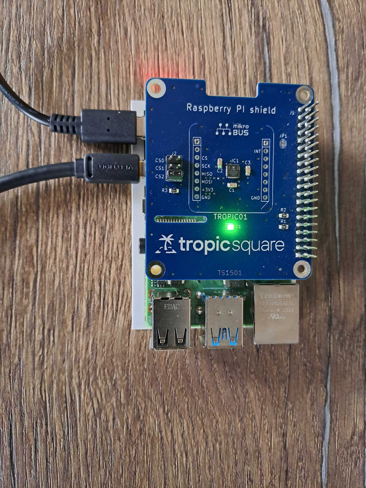

# Tutorial: Evaluation of libtropic on Raspberry Pi with Unix SPI drivers
Libtropic is an SDK written in C. It provides an application interface for communication with the TROPIC01 secure element chip. The library is maintained by Tropic Square and simplifies integration into user applications. Tropic Square strongly recommends using this library as it encapsulates low-level communication on the SPI interface into exposed API calls (check out the [API documentation](https://github.com/tropicsquare/tropic01/blob/main/doc/api/tropic01_user_api_v1.1.2.pdf)).  
For documentation on the libtropic SDK, please visit our [GitHub Pages](https://tropicsquare.github.io/libtropic/).

This document provides information on the application example `lt-util`, which integrates the [libtropic SDK](https://github.com/tropicsquare/libtropic) repository as a submodule and builds a command-line application demonstrating TROPIC01 features and recommended integration. The `lt-util` application supports the SPI present on the Raspberry Pi (RPi) using both wiringPi drivers and a native SPI kernel driver (spidev). In this tutorial, we will focus on using the native SPI driver on the [Raspberry Pi 4/5](https://www.raspberrypi.com/documentation/computers/getting-started.html) and the [Tropic01 RPi Shield (TS1501)](https://github.com/tropicsquare/ts-dev-kits/blob/main/ts1501-rpi-shield.md).

## Quick Start

### Hardware Preparation
In this tutorial, we recommend using the [Tropic01 RPi Shield (TS1501)](https://github.com/tropicsquare/ts-dev-kits/blob/main/ts1501-rpi-shield.md). **On the shield, short the CS2 pins with a jumper.**

Your setup should look like the following:




> [!IMPORTANT]
> Do not forget to short the CS2 pins.

### Steps to Build `lt-util`
The `lt-util` app must be compiled from source code. To build the `lt-util` application, you will need the CMake build system on your target platform.

1. Clone the repository:
```sh
git clone --recursive https://github.com/tropicsquare/libtropic-util.git
```

2. Build with CMake:
```sh
cd libtropic-util
mkdir build
cd build
cmake -DUNIX_SPI=1 -DLT_BUILD_EXAMPLES=1 ..
make
```

> [!TIP]
> If you need more verbose output or want to use debugging tools, add `-DCMAKE_BUILD_TYPE=Debug` to the other CMake flags on line 4 above.

3. Run:
```sh
./lt-util
```

> [!NOTE]
> This will output the usage of this example, showing all available flags and arguments that can be passed to the program.

### Verifying Chip Information
The first step is to check the information about the chip. Run `lt-util` with `-i`:
```sh
./lt-util -i 
```

This will verify that your platform can communicate with TROPIC01 properly via SPI and print various information about the chip, such as firmware version, silicon revision, and more.

### Running the Demo Script
We have prepared a script that runs various commands and outputs results as a demonstration of `lt-util`. Check out [`run_tests_hw_spi.sh`](test/HW_SPI/run_tests_hw_spi.sh).

## Troubleshooting
1. **The SPI is not working.**  
> You may need to activate the kernel module using `raspi-config`. Check out [this tutorial](https://www.raspberrypi-spy.co.uk/2014/08/enabling-the-spi-interface-on-the-raspberry-pi/).

2. **The Secure Session cannot be established, or the chip does not respond.**  
> Be aware of which revision of the chip you are using. The chip revisions are called ABAB for Engineering Samples and ACAB for Production Silicon.  
> Run the following command to identify which silicon revision you have available:
> ```sh
> ./lt-util -i  
> ```
> 
> By default, keys for Production Silicon are used in `lt-util`. If you need to use an Engineering Sample for some reason, compile with the appropriate keys like this:
> ```sh
> cd libtropic-util
> mkdir build
> cd build
> cmake -DUNIX_SPI=1 -DLT_BUILD_EXAMPLES=1 -DLT_SH0_PRIV_PATH=../libtropic/provisioning_data/sh0_priv_engineering_sample01.pem ..
> make
> ```

3. **Other problems**  
> - If you are a customer, contact Tropic Square via the [Support Portal](http://support.tropicsquare.com) or contact your business partners.  
> - Otherwise, [open an issue](https://github.com/tropicsquare/libtropic-util/issues/new/choose).

## Details About the `libtropic-util` Implementation
The `libtropic-util` example is implemented in the [main.c](src/main.c) source file.

To make the libtropic API and other related functionalities available, a few includes are added at the beginning of the file:
```c
#include "libtropic.h"         // The core API functions.
#include "libtropic_port.h"    // Common HAL functions, required by libtropic for every port.
#include "libtropic_logging.h" // Macros for logging at INFO, WARNING, and ERROR levels.
#include "libtropic_common.h"  // Definitions of commonly used macros, structures, or enums.
```

> [!NOTE]
> All libtropic API functions are prefixed with `lt_`.

In the `main.c` file, there are macros for various communication interfaces, but the `UNIX_SPI` is the important one for this document/RPi example.

In the `main()` function for the `UNIX_SPI` interface, the device is first initialized:
```c
// This will set up mappings compatible with RPi and our RPi shield.
lt_dev_unix_spi_t device = {0}; // This structure is defined in libtropic_port.h.
strcpy(device.gpio_dev, "/dev/gpiochip0");
strcpy(device.spi_dev, "/dev/spidev0.0");
device.spi_speed = 1000000; // 1 MHz
device.gpio_cs_num = 25;    // GPIO 25 as on RPi shield.

// This initializes the device field in the libtropic's handle, later used in all API functions.
lt_handle_t h; // This structure is defined in libtropic_common.h.
h.l2.device = &device;
```

After initialization, based on the input from the command line, the arguments are parsed, and specific commands are executed. For example, if the `-i` argument is passed, the `process_chip_id()` function is called:

```c
if (argc == 2) {
    if (strcmp(argv[1], CHIP_ID) == 0) {
        return process_chip_id(&h);
    }
}
```

The `process_chip_id()` function is not an API function and is defined in the discussed `main.c` file. This function is just a wrapper for a sequence of libtropic API calls to print the chip ID to stdout. Let’s take a look at it:

```c
static int process_chip_id(lt_handle_t *h) {

    struct lt_chip_id_t chip_id; // Defined in libtropic_common.h, encapsulates the CHIP_ID structure.

    // Libtropic API function to initialize the libtropic's handle to be ready for the communication.
    // It should always be called at the beginning of the program or after lt_deinit().
    lt_ret_t ret = lt_init(h);
    
    // Check if lt_init() was successful. Return value should be checked for every API call.
    if(ret != LT_OK) {
        LT_LOG_ERROR("Error lt_init(): %s", lt_ret_verbose(ret));
        return 1;
    }

    // Libtropic API function to execute a Layer 2 request for the CHIP_ID structure from the chip.
    ret = lt_get_info_chip_id(h, &chip_id);
    if (ret != LT_OK) {
        LT_LOG_ERROR("Error lt_get_info_chip_id: %s", lt_ret_verbose(ret));
        return 1;
    }
    
    // Helper libtropic function to parse and print the CHIP_ID structure using the passed printf-like function -- in this case, directly printf().
    ret = lt_print_chip_id(&chip_id, printf);
    if (ret != LT_OK) {
        LT_LOG_ERROR("Error lt_print_chip_id: %s", lt_ret_verbose(ret));
        return 1;
    }

    // Libtropic API function to deinitialize the handle. The result of this call also deinitializes the device interface used for communication with the chip.
    // Return value should be checked, but in this case, there is nothing to do anyway if the error occurs.
    lt_deinit(h);

    return 0;
}
```

> [!NOTE]
> Naturally, there are other wrapper functions like `process_chip_id` in the discussed `main.c` file (all have the prefix `process_`). Some of them execute Layer 3 API calls, which also require establishing a secure session with one of the pairing key slots, usually with the provisioned slot 0. For establishing the secure session, we recommend using the helper function `verify_chip_and_start_secure_session()` from `libtropic.c`, which executes multiple API command calls, including the two most important ones: `lt_get_st_pub()` and `lt_session_start()`.

## Creating a New Application / Embedded Platform with the libtropic SDK
All necessary HAL functions are declared in the libtropic header [`libtropic_port.h`](https://github.com/tropicsquare/libtropic/blob/master/include/libtropic_port.h). The implementation of these HAL functions should be placed in the directory `libtropic/hal/port/`.

More specifically, the discussed Unix SPI port is implemented in the file [`libtropic/hal/port/unix/lt_port_unix.c`](https://github.com/tropicsquare/libtropic/blob/develop/hal/port/unix/lt_port_unix.c).
